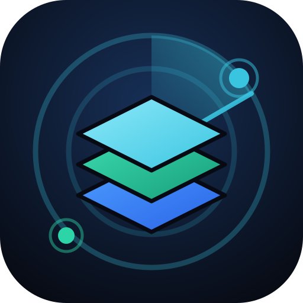
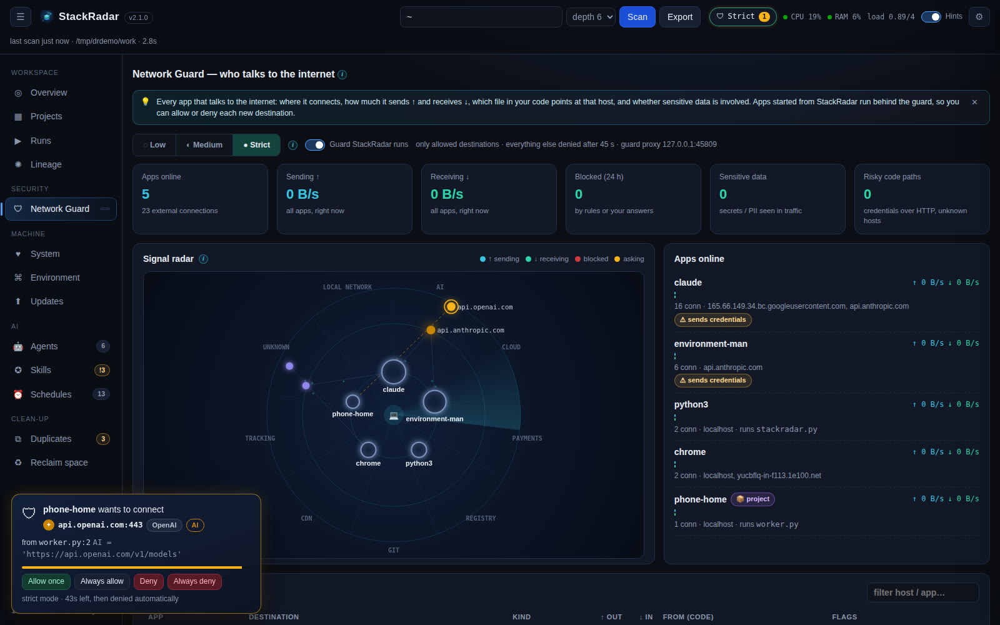
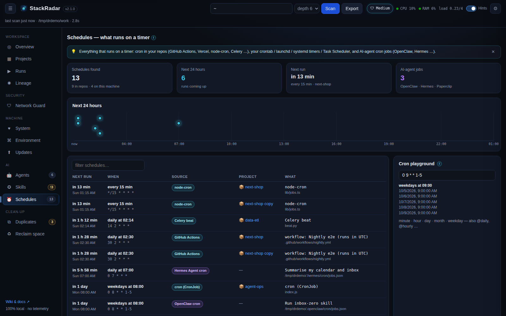
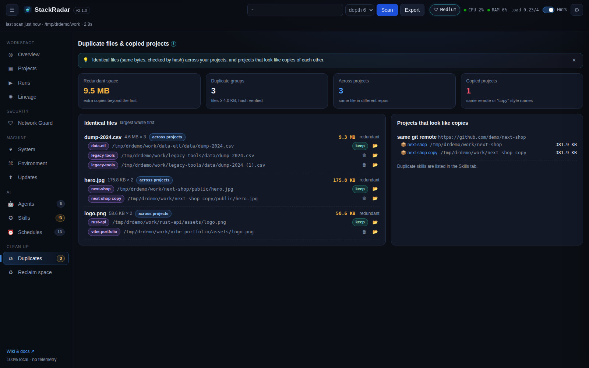

<div align="center">



# StackRadar — your whole stack on one local screen: repos, ports, secrets, network traffic, AI agents, skills and schedules

**A free, 100% local developer-workspace dashboard for macOS, Windows and Linux.**
Find every project on your computer, see what it is and how to run it, catch leaked API keys, **see and block what each app sends to the internet**, watch CPU / memory / load,
track Claude Code, Codex, Hermes, OpenClaw and Paperclip agents, spot unused or duplicate skills, list every cron job,
dedupe files, compress archived projects and update outdated packages in one click.

<sub>Formerly **DevRadar** (renamed in 2.1 because the old name clashed with other developer projects).</sub>

[Download](#install) · [Watch the 56-second tour](media/video/stackradar-promo.mp4) · [Wiki](https://github.com/SYasJ/StackRadar/wiki) · [Changelog](CHANGELOG.md)


</div>

---

## Why StackRadar?

If you vibe-code with several AI agents, your machine slowly fills up with half-finished apps, forgotten `.env` files, mystery
ports, duplicate skills and cron jobs nobody remembers. StackRadar scans the folders you choose and answers, for **every**
project it finds:

| You ask | StackRadar shows |
|---|---|
| What is this repo and how do I run it? | Purpose (README / manifest), language, framework, the exact run command and why |
| Did I leave API keys lying around? | Every secret, **masked**, with file and line. Plus `.env` files git would commit |
| Which app is sending my data, and where? | **Network Guard**: live connections per app with bytes ↑ / ↓, the **file and line** behind each one, sensitive-data alerts, and **allow / deny** prompts with **Low / Medium / Strict** levels |
| What's running and on which port? | Live ports with their process, the ports each app *should* use, one-click start / stop |
| How does it all connect? | An interactive **lineage graph**: projects ↔ runtimes ↔ dependencies ↔ ports ↔ secrets ↔ AI tools ↔ skills ↔ schedules |
| Is my machine struggling? | Live **CPU, per-core, load average, memory, swap, disk, network** and the heaviest processes |
| Which AI agents do I have? | **Claude Code, Codex CLI, Hermes Agent, OpenClaw, Paperclip, Gemini CLI, Cursor, Windsurf, Copilot CLI, OpenCode, Goose, Aider, Qwen Code, Amp, Kiro, Continue, Cline/Roo, Ollama, LM Studio**: version, sessions, MCP servers, tokens, running |
| Which skills do I actually use? | Every `SKILL.md`, slash command and sub-agent, real usage counts, never-used and **duplicate skills** |
| What runs on a timer? | GitHub Actions / Vercel / node-cron / Celery crons, your crontab, launchd, systemd timers, Task Scheduler and **agent cron jobs**, with next-run countdowns |
| Where is my disk space going? | Space hogs, reclaimable caches, **hash-verified duplicate files**, copied projects, and **archive = compress** (verified `.tar.gz`/`.zip`, restore any time) |
| What's outdated? | Global npm / pip / Homebrew packages and per-project dependencies, **updated from the app** |

Every panel has an ⓘ hint, and one switch turns them all off. Features you don't use can be hidden in Settings.

## Screenshots

| | |
|---|---|
|  **Network Guard**: who talks to the internet |  **Allow / deny** every new destination |
|  **Lineage**: force, radial and flow layouts |  **System**: live CPU, memory, load and disk |
|  **Agents**: every AI coding agent on the machine |  **Skills**: used, unused, duplicated |
|  **Schedules**: what runs at 2 a.m. |  **Duplicates**: keep one, trash the rest |

🎬 **[Watch the 56-second promo](media/video/stackradar-promo.mp4)** (silent, 1280×720)

## Install

### Desktop app (recommended)

Download the latest release for your OS from **[GitHub Releases](https://github.com/SYasJ/StackRadar/releases)**:

| OS | File | Notes |
|---|---|---|
| macOS (Apple silicon + Intel) | `StackRadar-x.y.z-mac-arm64.dmg` / `-x64.dmg` | Drag to Applications. Unsigned builds: right-click → **Open** the first time |
| Windows 10/11 | `StackRadar-x.y.z-win-x64.exe` (installer) or `StackRadar-x.y.z-portable.exe` | SmartScreen may warn on unsigned builds: **More info → Run anyway** |
| Linux | `StackRadar-x.y.z-linux-x86_64.AppImage` or `.deb` | `chmod +x` the AppImage and run it |

The desktop app bundles its own engine (no Python needed) and **updates itself** from GitHub Releases.

### Run from source (any OS, Python 3.9+, no dependencies)

```bash
git clone https://github.com/SYasJ/StackRadar.git && cd StackRadar
python3 stackradar.py                 # scans your home folder → http://localhost:8765
python3 stackradar.py --root ~/Projects --depth 4 --open
```

Windows: `python stackradar.py`, or double-click `StackRadar.bat`. macOS: double-click `StackRadar.command`.

## Privacy & safety

- **Nothing leaves your machine.** No telemetry, no accounts. The only network calls are ones you click (check outdated packages, update packages, check for a StackRadar update).
- The server listens on **127.0.0.1 only**, and every API call needs a per-launch token (blocks CSRF and DNS-rebinding attacks from websites).
- Secrets are **always masked** (first 4 / last 2 characters).
- The Network Guard never decrypts HTTPS, and only changes your OS firewall after you confirm a dialog that shows the exact command.
- Delete moves to the **Trash / Recycle Bin**. Permanent delete needs the folder name typed. Kill / stop only targets processes inside scanned projects.
- Package updates run your own package manager with validated package names. No shell strings.

More: [Security & privacy](docs/wiki/Security-and-Privacy.md).

## Documentation

The **[StackRadar wiki](https://github.com/SYasJ/StackRadar/wiki)** (source in [`docs/wiki`](docs/wiki/Home.md)) covers [installation](docs/wiki/Installation.md), a [feature tour](docs/wiki/Features-Tour.md),
the [Network Guard](docs/wiki/Network-Guard.md), the [lineage graph](docs/wiki/Lineage-Graph.md), [AI agents & skills](docs/wiki/AI-Agents-and-Skills.md), [schedules](docs/wiki/Schedules.md),
the [system monitor](docs/wiki/System-Monitor.md), [package updates](docs/wiki/Package-Updates.md), [hints & settings](docs/wiki/Hints-and-Settings.md),
the [desktop app & auto-update](docs/wiki/Desktop-App-and-Auto-Update.md), the [local API](docs/wiki/Local-API.md),
[releasing & versioning](docs/wiki/Releasing-and-Versioning.md), the [FAQ](docs/wiki/FAQ.md) and [troubleshooting](docs/wiki/Troubleshooting.md).
A landing page lives in [`docs/index.html`](docs/index.html) (deployed with GitHub Pages).

## Project layout

```
StackRadar/
├── stackradar.py        ← the engine: scanner + local HTTP server + actions (stdlib only)
├── index.html           ← dashboard shell
├── static/              ← app.js (core) · features.js (tabs, hints, updates) · network.js (Network Guard) · lineage.js (graph) · style.css · icon.svg
├── desktop/             ← Electron app (dmg / exe / AppImage) + auto-update
├── docs/                ← landing page (SEO) + wiki pages
├── demo/                ← fake-workspace generator + screenshot script
├── tests/               ← unit + HTTP security tests  (python3 -m unittest discover -s tests)
├── scripts/bump_version.py
├── VERSION · CHANGELOG.md
└── media/               ← screenshots, promo video
```

## Maintainer & releases

StackRadar is built and maintained by [@SYasJ](https://github.com/SYasJ). Bug reports and ideas are welcome as
[issues](https://github.com/SYasJ/StackRadar/issues). Tests: `python3 -m unittest discover -s tests`. Releases are cut with
`python3 scripts/bump_version.py minor` → `git tag vX.Y.Z` → push. GitHub Actions then builds and publishes the installers.
See [Releasing & versioning](docs/wiki/Releasing-and-Versioning.md).

<sub>Keywords: developer dashboard, application firewall, outbound connection monitor, per-app network monitor, little snitch alternative, data exfiltration detection, local dev environment manager, project finder, port monitor, API key scanner, secrets
detection, Claude Code token usage, AI agent manager, MCP servers, SKILL.md manager, cron job viewer, duplicate file finder,
outdated npm packages, pip updates, Homebrew, system monitor, Electron app, macOS, Windows, Linux.</sub>
