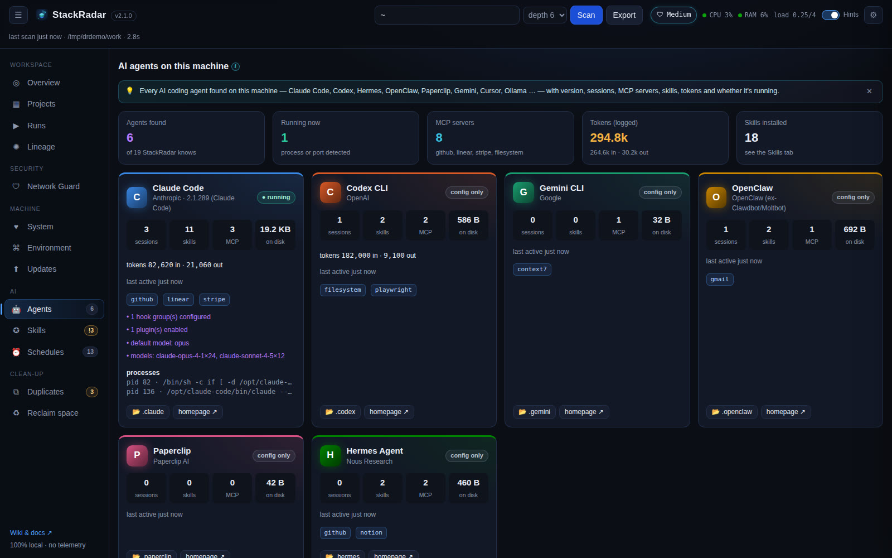
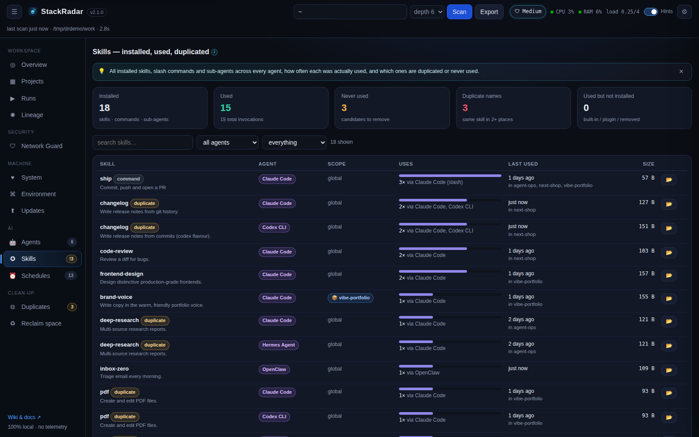

# AI agents & skills

## Agents tab

StackRadar detects an agent when its **CLI is on your PATH** or its **config folder exists**:

| Agent | CLI | Folder(s) checked | Extras read |
|---|---|---|---|
| Claude Code | `claude` | `~/.claude` | sessions, tokens, models, MCP servers (`~/.claude.json`), hooks, enabled plugins |
| Codex CLI | `codex` | `~/.codex` | sessions, token totals, MCP servers (`config.toml`) |
| Hermes Agent (Nous Research) | `hermes` | `~/.hermes` | sessions, MCP servers (`config.yaml`), cron jobs |
| OpenClaw (ex-Clawdbot / Moltbot) | `openclaw` | `~/.openclaw`, `~/.clawdbot`, `~/.moltbot` | sessions, MCP, cron jobs, gateway port 18789 |
| Paperclip | `paperclipai` | `~/.paperclip` | server port 3100 |
| Gemini CLI | `gemini` | `~/.gemini` | sessions, MCP servers |
| Cursor · Windsurf · Copilot CLI · OpenCode · Goose · Aider · Qwen Code · Amp · Kiro · Continue · Cline/Roo | various | various | MCP servers where stored |
| Ollama · LM Studio | `ollama` · `lms` | `~/.ollama` · `~/.lmstudio` | local models, ports 11434 / 1234 |

Each card shows version, sessions, last activity, skills, MCP server **names** (never their env values or keys),
logged tokens, on-disk size, matching running processes and ports. A status badge says **running**, **installed** or
**config only**. Agents StackRadar knows about but didn't find are listed at the bottom, so you know what was checked.

## Skills tab

### What counts as a skill
- `SKILL.md` folders: `~/.claude/skills`, Claude Code plugin skills, `~/.codex/skills`, `~/.agents/skills`, `~/.hermes/skills`,
  `~/.openclaw/skills` and `~/.openclaw/workspace/skills`, `~/.gemini/skills`, `~/.cursor/skills`, OpenCode, Goose, Copilot …
- **Slash commands** (`~/.claude/commands/*.md`, `~/.codex/prompts`, Gemini `commands/*.toml`) and **sub-agents** (`~/.claude/agents/*.md`).
- Project-level copies: `<project>/.claude/skills`, `.agents/skills`, `.codex/skills`, `skills/*/SKILL.md` …
- `skills-lock.json` pins.

### How usage is counted
- **Claude Code**: every `Skill` tool call and every `/slash-command` in `~/.claude/projects/**/*.jsonl` (newest first, up to 300 MB of logs), with the project (`cwd`) it happened in.
- **Codex / Hermes / OpenClaw**: mentions of `<skill-folder>/SKILL.md` in their session logs (they *read* the file instead of calling a tool). Best effort.

### What you see
- **Installed / used / never used / duplicate names / used-but-not-installed** cards (click to filter).
- Per skill: agent, scope (global or project), usage bar, which agents used it, last used, which projects, size, 📂 reveal.
- **Duplicate skills**: the same name in several places, marked **identical copies** (safe to remove extras) or **different versions** (they can behave differently depending on which agent loads them).
- **Most-used Claude Code tools** and **used but not installed** (built-in, plugin-provided or deleted skills).
- In each project's drawer: skills installed in that project and skills used while working there.
