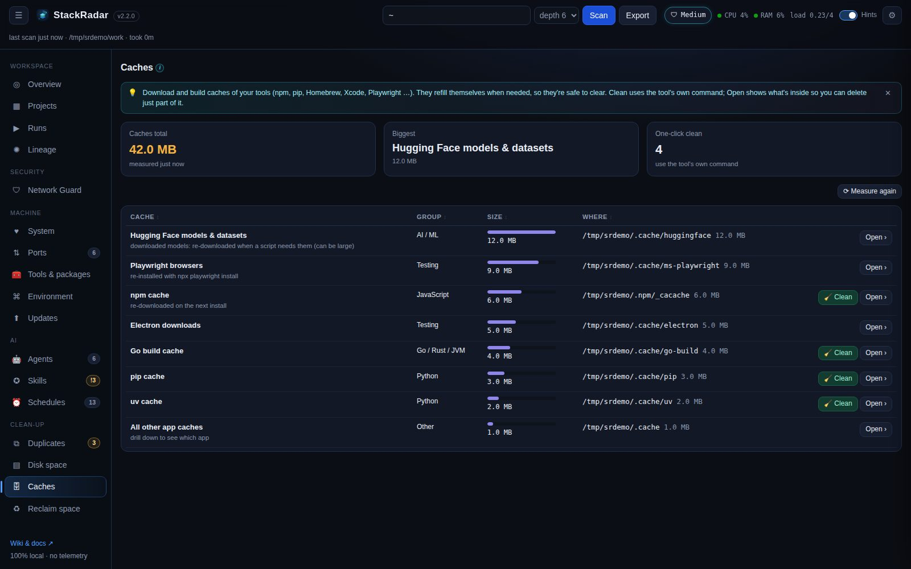
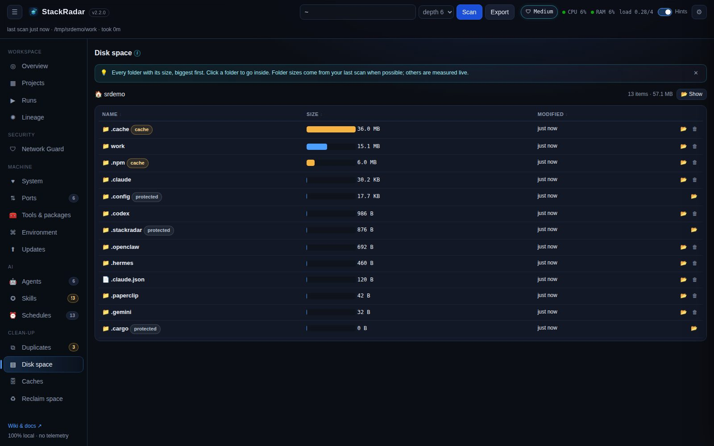

# Caches & disk space

## Caches

Download and build caches your tools keep. They refill themselves when needed, so they're safe to clear.

| Group | Caches |
|---|---|
| JavaScript | npm, Yarn, pnpm store, Bun |
| Python | pip, uv, Poetry |
| AI / ML | Hugging Face models & datasets, PyTorch hub, Ollama models (your local LLMs: remove one with `ollama rm`) |
| System tools | Homebrew downloads and old versions |
| Go / Rust / JVM | Go module and build caches, Cargo registry, Gradle, Maven |
| Apple | Xcode DerivedData, iOS Simulator caches, old iOS device support, CocoaPods |
| Testing | Playwright, Puppeteer and Cypress browsers, Electron downloads |
| Editors & browsers | VS Code, Chrome, Firefox caches |
| Other | the Trash, and every other app cache (`~/Library/Caches`, `~/.cache`, `%LOCALAPPDATA%\Temp`) |

- **🧹 Clean** runs the tool's own command (`npm cache clean --force`, `pip cache purge`, `brew cleanup --prune=all`,
  `go clean -modcache`, `pnpm store prune`, `uv cache clean` …) as a job with a log.
- **Open ›** jumps to that folder in **Disk space**, so you can delete just part of it.
- Docker's own disk use (`docker system df`) is shown with the prune command.

Caches are measured when you open the tab (**⟳ Measure again** to refresh).

## Disk space

Every folder with its size, biggest first, starting at your home folder. Click a folder to go inside, use the
breadcrumbs to go back. Folder sizes come from your last scan where possible (instant); others are measured live.

- 📦 marks a project, **cache** marks a cache folder.
- 🗑 **Delete** asks you to type the name. By default it goes to the Trash; tick **delete permanently** to free the
  space right away (pre-ticked for caches).
- Your **home folder and its standard folders** (Desktop, Documents, Downloads, Pictures, Library, AppData, `.ssh`,
  `.config` …) are marked **protected** and can never be deleted from StackRadar.

The **Lineage** drill-down and each project's drawer link here (**▤ folder sizes**).
