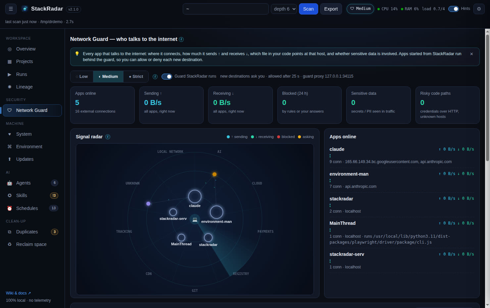

# Desktop app & auto-update



The desktop app is a thin **Electron** shell around the same engine you can run from source:

1. On launch it starts the bundled engine (`stackradar-server`, frozen with PyInstaller, so no Python is required) on a **random free port on 127.0.0.1**.
2. It waits for the engine's `STACKRADAR_READY port=N` line, then loads the dashboard in its window.
3. It borrows your **login shell's PATH**, so the engine finds Homebrew, nvm, pyenv, `git`, `docker`, `claude`, `codex` … even when launched from the Dock or Start menu.
4. Only one instance runs at a time. External links open in your browser. Quitting stops the engine.

Menu: **File → Open in Browser**, **Show Settings Folder** · **Help → Check for Updates…**, Wiki, Report an Issue.

## Auto-update

The app uses **electron-updater** against this repository's **GitHub Releases**:
- 8 seconds after launch, and every 6 hours, it checks the latest release's `latest*.yml`.
- If a newer version exists it downloads in the background, then asks **Restart now / Later**.
- **⚙ Settings → Check for updates** or **Help → Check for Updates…** triggers a check right away.

| Platform | Auto-update |
|---|---|
| Windows NSIS installer | ✅ |
| Linux AppImage | ✅ |
| macOS | ✅ for **signed & notarized** builds. Unsigned builds show the update but macOS blocks silent install, so download the new `.dmg` manually |
| Windows portable / Linux `.deb` | ❌ download new versions manually |

## Building it yourself

```bash
cd desktop
npm ci
python3 -m pip install pyinstaller
npm run dist:mac     # or dist:win / dist:linux  → desktop/release/
npm start            # dev mode: runs ../stackradar.py with your Python
```

`npm run dist*` first runs `scripts/build-backend.js` (PyInstaller → `dist/stackradar-server/`), which also syncs
the app version from `VERSION`. CI builds all three platforms on every `v*` tag. See [Releasing](Releasing-and-Versioning.md).
