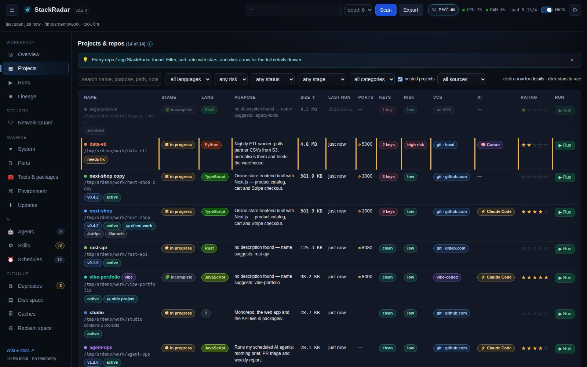
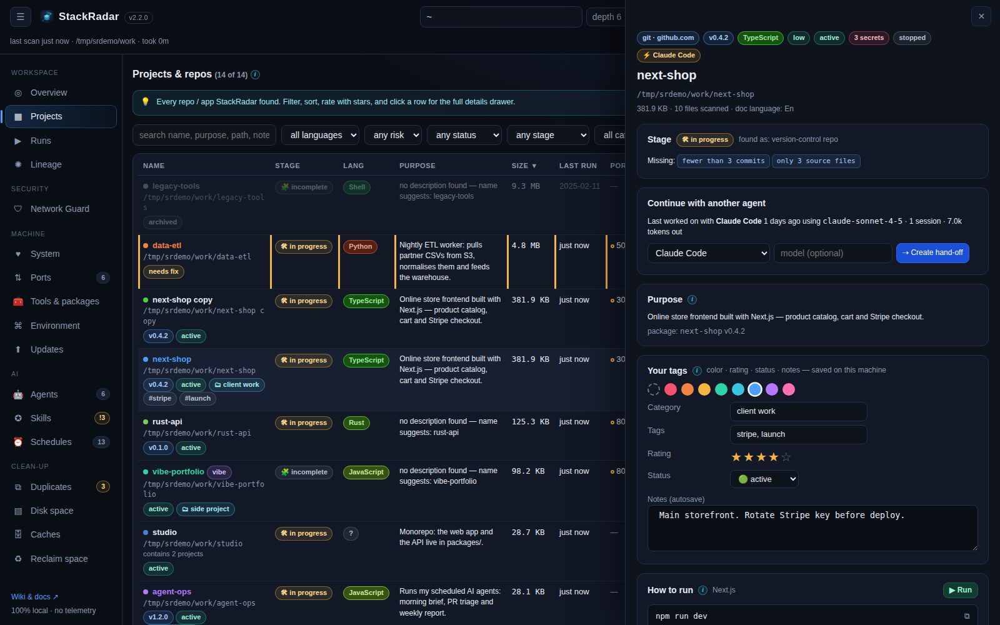
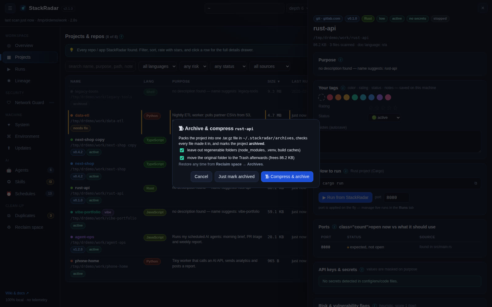
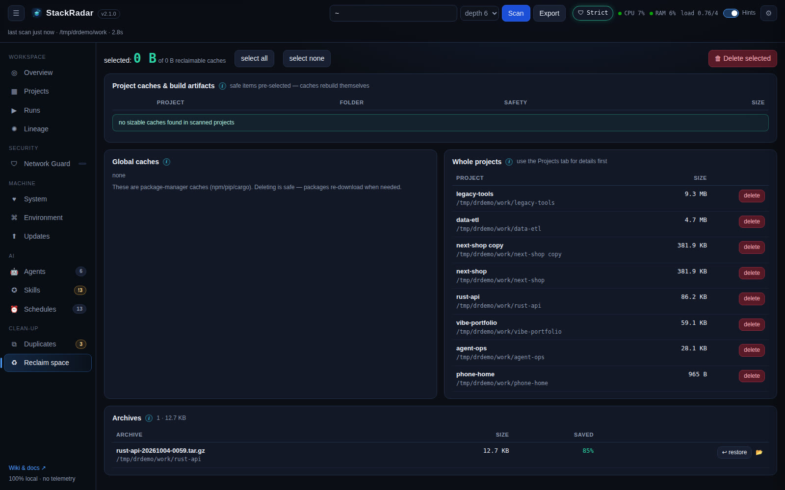

# Feature tour

StackRadar's sidebar groups the tabs into **Workspace**, **Machine**, **AI** and **Clean-up**. Every panel has an ⓘ hint
(hover or keyboard-focus it). Any tab except Overview / Projects / Environment can be switched off in **⚙ Settings**.
**Every table sorts**: click a column header, click again to reverse. Light / dark mode and colors: [Themes](Themes.md).

## Workspace

### Overview

KPI cards (projects, total size, secrets, open ports, high risk, running now, AI/IDE traces, agents, skills, schedules,
duplicate space, system load), the top space hogs, size by language, and a prioritised **alert list**. Cards are clickable.

### Projects

A sortable, filterable table of every project: colour tag, version, status (active / needs fix / archived), **stage**,
language, purpose, size, last run, ports (open = green, expected = amber), secret count, risk, VCS, AI tool, star rating
and a **▶ Run / ■ Stop** button.

- **Every project is found**, including projects inside projects (packages in a monorepo, a repo inside a repo: shown
  with *↳ inside …*), plain git repos with no package file, and unfinished folders (a README plus some code, a few loose
  scripts, notebooks, a static site). Your home folder itself is never treated as a project.
- **Stage**: ✅ *ready* (runnable, described, in version control), 🛠 *in progress* or 🧩 *incomplete*, with what's
  missing (no run command, no README, not in git, fewer than 3 commits, only a few source files, no manifest).
- **Categories and tags**: give projects your own category (client work, side project, learning …) and tags in the
  drawer; filter by category.
- **Click any tag** (language, dependency, AI tool, stage, category, your tags) to see every project that has it, and
  for a dependency, what that package does.

**The details drawer** (click a row):

Stage and what's missing · parent / nested projects · **continue with another agent** (see
[AI agents & skills](AI-Agents-and-Skills.md#continue-with-another-agent)) · purpose · your category, tags & notes · how to run (+ ▶ run with a port) · ports · masked secrets · risk flags · last run evidence ·
git origin · dependencies with **outdated check and ⬆ update buttons** · schedules found in the code · skills used here ·
AI traces and token usage · documents · size breakdown · danger zone (delete to Trash, move, rename, show in file manager).

### Runs
Start any project from StackRadar and watch a live, Colab-style console. Restart on another port, stop one or all, and kill
processes that belong to scanned projects (system processes are never listed).

### Lineage
See [Lineage graph](Lineage-Graph.md).

## Security

### Network Guard

Live signal radar of every app that talks to the internet, bytes ↑ / ↓, the file and line behind each connection,
allow / deny prompts and Low / Medium / Strict levels. See [Network Guard](Network-Guard.md).

## Machine

### System

See [System monitor](System-Monitor.md).

### Ports
Every listening port with its program, project and who can reach it, and **Stop / Force kill**. See [Ports](Ports.md).

### Tools & packages
Versions, newest versions, last used, unused packages, update / remove, and what's new. See [Tools & packages](Tools-and-Packages.md).

### Environment
Installed tools and versions, global npm / pip / Homebrew packages, Docker containers / images / disk use, shell rc
analysis (exports, aliases, PATH additions, version managers) and installed IDEs.

### Updates

See [Package updates](Package-Updates.md).

## AI

### Agents

### Skills

See [AI agents & skills](AI-Agents-and-Skills.md).

### Schedules

See [Schedules](Schedules.md).

## Clean-up

### Duplicates

Four views, so nothing is called a duplicate unless it really is one:

| View | Rule |
|---|---|
| **Exact duplicates** | same **file name**, same **size** and byte-for-byte the same **content** (SHA-256 of the whole file). Safe to keep one |
| **Same content, different name** | identical bytes saved under another name (`photo.png` = `photo-final.png`) |
| **Same name, different content** | *not duplicates*: e.g. two versions of `banner.png`. Shows size, date and image dimensions (1920×1080 vs 1920×1081); files tagged with the same *version* match each other. Common names (README.md, package.json …) are left out |
| **Copied projects** | same git remote, or names like `app copy`, `app (1)`, `app-old`, `app-2024-05-01` |

Files ≥ 4 KB in your projects are compared (each file once, even in nested projects). Add folders like `~/Pictures` or
`~/Downloads` and press **⟳ Check again**. Each group suggests one copy to **keep** (the oldest, without `copy` / `(1)`
in its name); 🗑 moves another copy to the Trash.

### Archive = compress

Setting a project's status to **archived** (or **🗜 Compress & archive…** in its drawer) packs it into one `.tar.gz`
(`.zip` on Windows) in `~/.stackradar/archives`. Regenerable folders (`node_modules`, `.venv`, build caches) are left
out, every file is verified in the archive, and the original can go to the Trash. **Reclaim space → Archives** lists them
with their size and space saved, and **↩ restore** unpacks one where it was (it refuses to overwrite an existing folder).

### Disk space · Caches
Folder sizes with drill-down and delete, and every tool cache with one-click clean. See [Caches & disk space](Caches-and-Disk-Space.md).

### Reclaim space
Regenerable folders (`node_modules`, `.next`, `dist`, `build`, `target`, `__pycache__` …) pre-selected for deletion,
virtualenvs flagged for a second look, global package-manager caches, and your largest projects.
