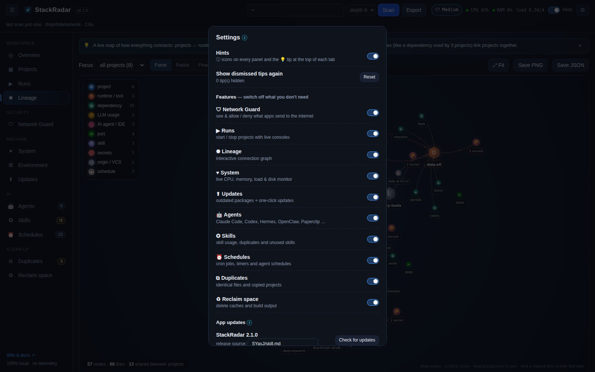

# Hints & settings

## Hints
- Every panel title has an **ⓘ** icon. Hover or Tab to it for a one-line explanation of what the panel shows and where the data comes from.
- Each tab opens with a **💡 tip**. Click ✕ to dismiss it for good.
- The **Hints** switch in the top bar hides all ⓘ icons and tips at once. **⚙ Settings → Show dismissed tips again** brings the tips back.

## Feature toggles
⚙ **Settings → Features** switches off whole tabs you don't need: Network Guard, Runs, Lineage, System, Updates, Agents, Skills,
Schedules, Duplicates, Reclaim space. Hidden tabs disappear from the sidebar (and their Overview cards). Turning a
feature off only hides it. The scan still collects the data, so turning it back on is instant.

## Other preferences
- Lineage layout and motion are remembered.
- The sidebar can be collapsed (☰). The last tab you used is restored on reload.
- **Release source**: the GitHub `owner/repo` StackRadar checks for app updates.

Settings live in `~/.stackradar/settings.json`. Project tags, ratings and notes live in `~/.stackradar/projects.json`.
