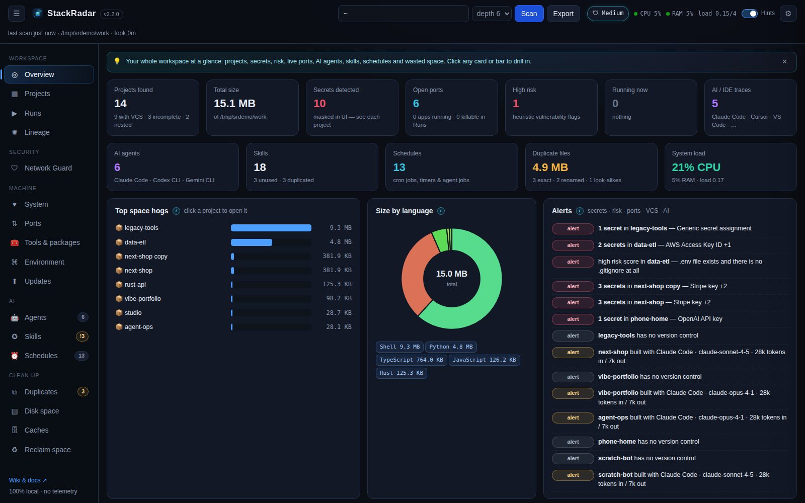

# StackRadar wiki

> **Current version: 2.2.0** · [Download](https://github.com/SYasJ/StackRadar/releases/latest) · [Changelog](https://github.com/SYasJ/StackRadar/blob/main/CHANGELOG.md)
>
> StackRadar was called **DevRadar** until v2.1. The old name clashed with several other developer projects.

**StackRadar** is a 100% local dashboard, free for personal use ([license](https://github.com/SYasJ/StackRadar/blob/main/LICENSE)), for your developer machine. It finds every repo and app in the folders
you choose and shows, on one screen, what each one is, how to run it, which ports and secrets it has, which AI agents and
skills touched it, what runs on a schedule, where your disk space went, and which packages are outdated.

## Start here

| | |
|---|---|
| 🚀 [Installation](Installation.md) | Desktop app (dmg / exe / AppImage) or run from source |
| 🔓 [Installing unsigned builds](Installing-Unsigned-Builds.md) | Open Anyway (macOS) / Run anyway (Windows), step by step |
| 🧭 [Roadmap](Roadmap.md) | What's done, what's next |
| ⏱ [Quick start](Quick-Start.md) | Your first scan in two minutes |
| 🗺 [Feature tour](Features-Tour.md) | Every tab, what it shows, what you can do |
| ❓ [FAQ](FAQ.md) · 🛠 [Troubleshooting](Troubleshooting.md) | Common questions and fixes |

## Deep dives

- [Ports](Ports.md): every listening port, stop / force kill
- [Tools & packages](Tools-and-Packages.md): versions, newest versions, last used, unused, update / remove, what's new
- [Caches & disk space](Caches-and-Disk-Space.md): tool caches with one-click clean, folder sizes with drill-down
- [Themes](Themes.md): light / dark / auto, presets, every color
- [Network Guard](Network-Guard.md): see what every app sends and receives, from which file, and allow / deny it (Low / Medium / Strict)
- [Lineage graph](Lineage-Graph.md): how projects, runtimes, dependencies, ports, secrets, agents, skills and schedules connect
- [AI agents & skills](AI-Agents-and-Skills.md): Claude Code, Codex, Hermes, OpenClaw, Paperclip and more, plus skill usage and duplicates
- [Schedules](Schedules.md): every cron job, timer and agent job, with next-run times
- [System monitor](System-Monitor.md): CPU, load, memory, disk, network, processes
- [Package updates](Package-Updates.md): global and per-project updates from the app
- [Hints & settings](Hints-and-Settings.md): turn hints and whole features on or off
- [Desktop app & auto-update](Desktop-App-and-Auto-Update.md)
- [Security & privacy](Security-and-Privacy.md)
- [Local API](Local-API.md): script StackRadar from the command line
- [Releasing & versioning](Releasing-and-Versioning.md)

🎬 [56-second video tour](../../media/video/stackradar-promo.mp4)
