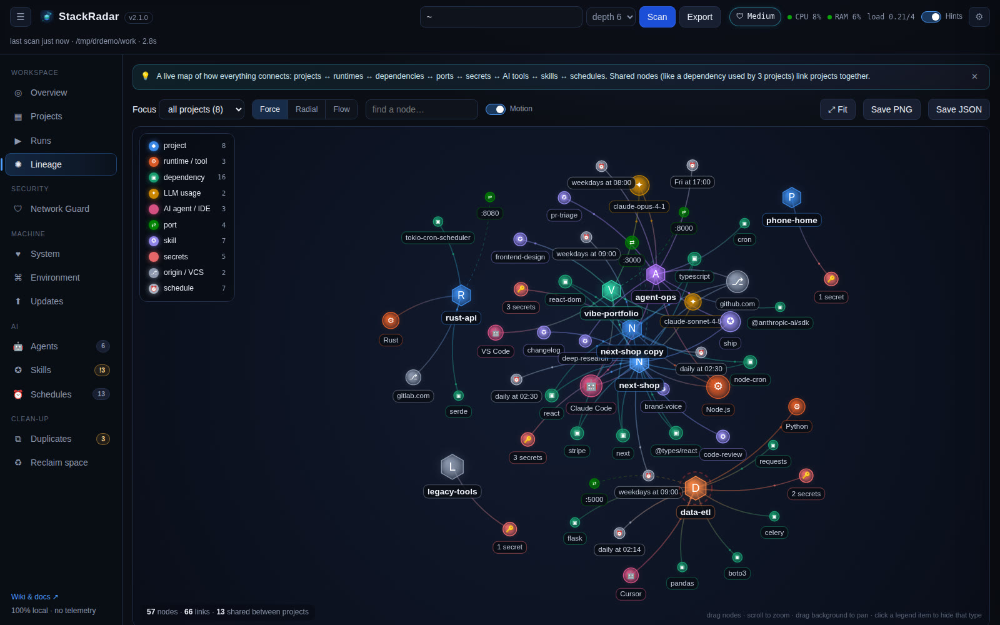
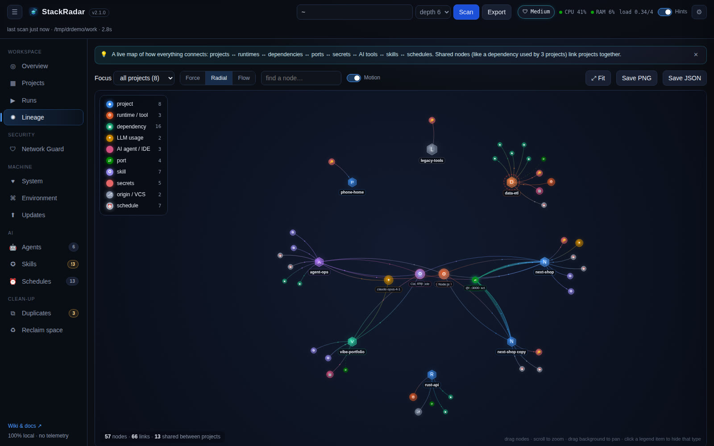
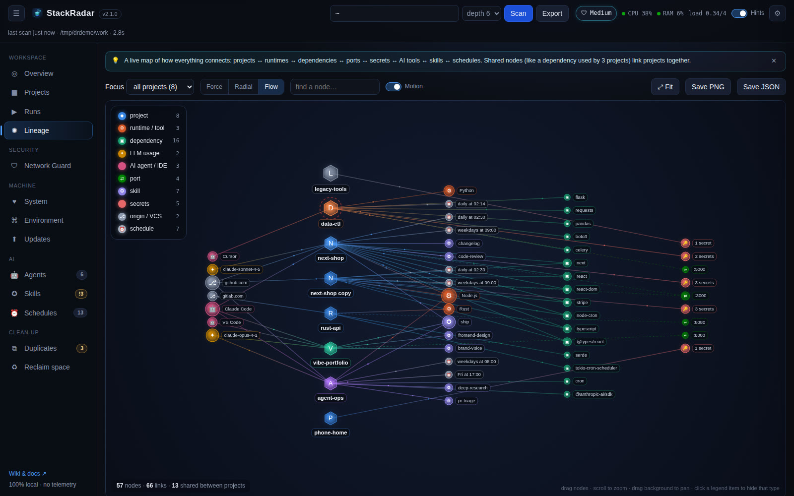

# Lineage graph

The lineage graph draws **everything StackRadar knows as one network**. A node shared by several projects (the same
dependency, runtime, git host, agent or skill) links those projects together, so you can see your stack at a glance.

## Node types

| Icon | Type | Comes from |
|---|---|---|
| ◆ (hexagon) | **project** | every scanned project. Size scales with disk use, colour = your tag |
| ⚙ | runtime / tool | Node.js, Python, Rust, Go, Ruby, Docker … |
| ▣ | dependency | `package.json`, `requirements*.txt`, `pyproject.toml`, `Cargo.toml` |
| ✦ | LLM usage | models found in Claude Code session logs |
| 🤖 | AI agent / IDE | marker folders (`.claude`, `.cursor`, `.vscode` …) |
| ⇄ | port | open now (pulsing ring) or expected (dashed link) |
| ✪ | skill | skills used while working in that project |
| 🔑 | secrets | count of masked secrets |
| ⎇ | origin / VCS | git host (github.com, gitlab.com …) |
| ⏰ | schedule | cron / timers found in the project |

Projects that are **running** get a pulsing green halo; **high-risk** projects get a dashed red halo. The eight
categorical colours are validated for colour-blind separation and contrast on the dark canvas. Every node also
carries an icon and a label, so colour is never the only cue.

## Layouts

| Layout | Best for |
|---|---|
| **Force** | organic clusters; shared dependencies float between their projects |
| **Radial** | projects on a ring, private attributes orbit their project, shared nodes pulled to the centre |
| **Flow** | left → right lineage: origin & agents → project → runtime / skills / schedules → dependencies → ports & secrets |

## Interacting

- **Hover** a node: tooltip, and its neighbourhood lights up while everything else dims.
- **Click** a node: details panel with **connected-node chips** (click a chip to jump there). **Double-click** a project to open its drawer.
- **Drag** nodes, **scroll** to zoom, drag the background to pan, **⤢ Fit** to frame everything.
- **Legend** items are toggles: hide dependencies to see just projects + agents, for example.
- **Find a node…** highlights matches and flies the camera to the first one.
- **Motion** switch: animated particles flowing along the links (turn off on slow machines).
- **Focus**: one project only (shows more of its dependencies, skills and schedules).
- **Save PNG** (2× resolution with a timestamp) or **Save JSON** (nodes + edges for your own tooling).
