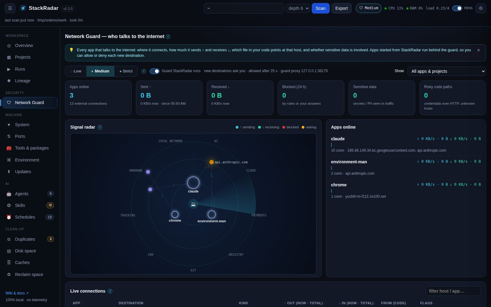
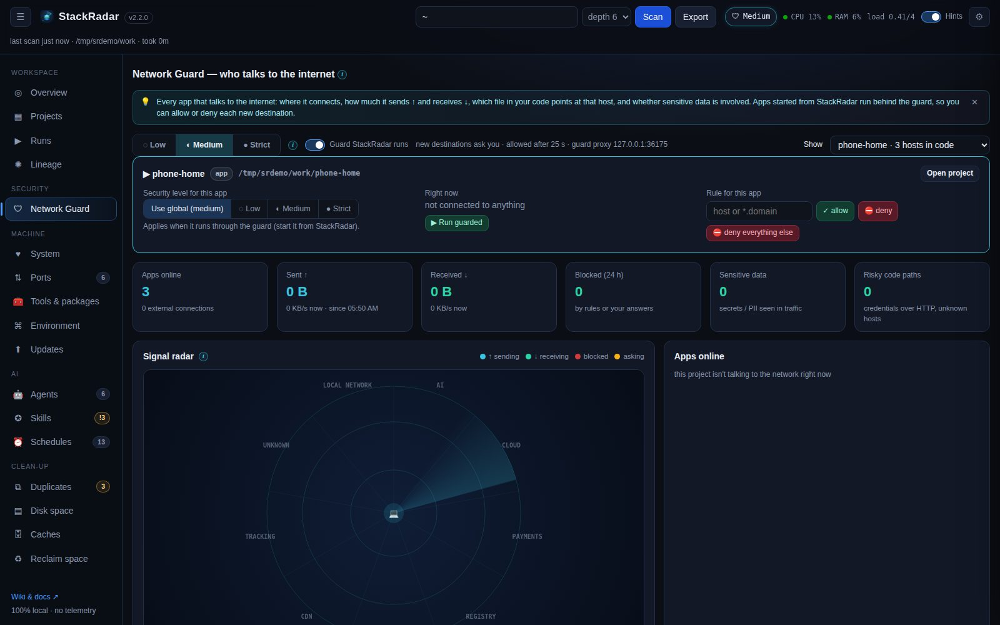

# Network Guard

**Which of my apps talk to the internet, what do they send, and from which line of code?** The Network Guard answers
that live and lets you **allow or deny** each destination.

## What you see

| Panel | Shows |
|---|---|
| **Signal radar** | Inner ring = your apps, outer ring = the hosts they talk to, grouped by kind (AI, cloud, payments, tracking, registry, git, CDN, local network, unknown). **Cyan dots flying out = data sent ↑**, **green dots flying in = data received ↓**. More / faster dots mean more bytes per second. **Red ✕ = blocked**, **amber pulse = waiting for your answer**. Hover for details, click a host to filter the tables |
| **Apps online** | Every process with external connections, its live ↑ / ↓ rate, hosts, the script it runs, and flags (*sends credentials*, *tracking*, *deny rule*) |
| **Live connections** | App · destination (host + IP) · kind / service · ↑ out · ↓ in · **from (code)**: the file and line that references this host · flags · actions (✓ always allow, ⛔ always deny, 🧱 block at the OS firewall) |
| **Guarded traffic** | Every request that went through the guard proxy, with bytes each way and anything sensitive it carried |
| **Guard log** | Every decision: allowed, blocked, asked, sensitive data, rule violations, possible data exfiltration |
| **Code map** | What your code is *wired* to talk to, found statically (see below) |
| **Rules** | Your allow / deny rules, per app or for all apps |

A 🛡 badge in the top bar shows the current level and pulses when an app is waiting for an answer, on any tab.

**Sent / received totals**: next to the live speed (KB/s, MB/s), every app and connection shows how much it has sent and
received in total (since StackRadar started; per connection on Linux, per app on macOS).

## One project at a time

Pick a project, app or repo in **Show** (top right). Every panel filters to it, and a panel lets you:

- give it **its own security level** (Low / Medium / Strict, or *use global*),
- add allow / deny rules just for it, or **deny everything else**,
- **▶ Run guarded** (start it behind the guard) or **■ Stop** its processes.

## Details and actions

Click any app or connection for a detail window: the destination, live and total traffic, the file and line behind
it, its rule, and buttons to **always allow / deny** (for this app or for every app), **block at the OS firewall**,
**show only this host** and **stop the app**. Rules can be flipped (⇄) or deleted (✕); the guard log can be cleared.

## How "which file is connecting" works

1. The process behind each connection is mapped to its **project** (working directory) and the **script it runs** (`node server.js`, `python worker.py` …).
2. During a scan StackRadar builds a **code map** of every project: URLs in the source (`https://api.stripe.com/v1/...`) with file and line, plus hosts implied by **SDKs in your dependencies** (`stripe` → `api.stripe.com`, `openai` → `api.openai.com`, `@sentry/*` → `*.sentry.io`, `posthog` → `*.posthog.com` …).
3. Hosts in the code map are resolved to IPs, so a live connection is traced back to `lib/payments.ts:12` even when the OS only knows the IP.

## Security levels

| Level | Apps started from StackRadar | Prompt timeout |
|---|---|---|
| **Low** | everything allowed, everything logged and flagged | none |
| **Medium** (default) | trusted developer hosts (npm, PyPI, GitHub, crates.io …) and **hosts your own code references** go straight through. Anything new asks you | allowed after 25 s |
| **Strict** | only hosts you allowed (or local ones). Everything else asks you. Plain-HTTP requests carrying secrets or personal data are **always blocked** | denied after 45 s |

Each prompt shows the app, the host and port, the service and kind, the **file + line** that references it (or a warning
that nothing in the project does), and any sensitive data found. Answer with **Allow once**, **Always allow**, **Deny**
or **Always deny**. "Once" answers are remembered for 10 minutes so an app isn't asked repeatedly.

## How blocking works (and its limits)

- **Apps started from StackRadar (Runs tab / drawer ▶ Run)** get `HTTP_PROXY` / `HTTPS_PROXY` pointing at StackRadar's
  local **guard proxy**, with a per-run identity. Every new destination goes through your rules and level, and blocked
  requests get `403 Blocked by StackRadar Network Guard`. This works for anything that honours proxy variables: curl,
  Python (requests / urllib / httpx), Go, Ruby, npm / pip, and Node 24+ (`NODE_USE_ENV_PROXY=1` is set for you).
  Turn it off with **Guard StackRadar runs**.
- The guard **chains through your existing proxy** (corporate `HTTPS_PROXY`) and honours `NO_PROXY`.
- **Other apps** (not started from StackRadar) are **monitored**, not intercepted. A deny rule they violate shows up as
  an alert. To actually stop them, use **🧱 Block at OS firewall**: StackRadar shows the exact command and runs it with your OS's admin prompt:

| OS | What it does |
|---|---|
| Windows | `New-NetFirewallRule -Direction Outbound -Action Block -RemoteAddress <IPs>` (UAC prompt) |
| macOS | a `pf` anchor `com.stackradar` with `block drop out quick to <IPs>` (password prompt) |
| Linux | an `nftables` table `inet stackradar` dropping traffic to `<IPs>` (`pkexec` prompt) |

  IP-based blocks affect every app, and CDN-hosted services can change IPs. Prefer guard rules where you can.

## Sensitive data

| Where | What StackRadar can see |
|---|---|
| **Plain-HTTP requests through the guard** | full request: headers, URL, body. Scanned for API keys (OpenAI, Anthropic, AWS, Stripe, GitHub …), JWTs, private keys, DB URLs with passwords, `Authorization` / `Cookie` headers, email addresses, card numbers, `password=` fields |
| **HTTPS through the guard** | host, port, bytes each way. Contents stay encrypted (StackRadar never installs a certificate or decrypts traffic) |
| **Your code (static)** | credentials used near a network call, credentials over plain HTTP, secrets sent to an unrecognised host, analytics / tracking SDKs |
| **Any process** | sustained large uploads (> 2 MB/s) to an unrecognised host raise a *possible data exfiltration* alert |

## Data sources per OS

| OS | Connections | Bytes ↑ / ↓ |
|---|---|---|
| Linux | `ss -tunpi` (per socket), falls back to `/proc/net/tcp*` | per socket via `ss` |
| macOS | `lsof -i` | per process via `nettop` |
| Windows | `netstat -ano` | guarded runs only |

Rules live in `~/.stackradar/network-rules.json`. The level and the run-guard switch live in `~/.stackradar/settings.json`.
