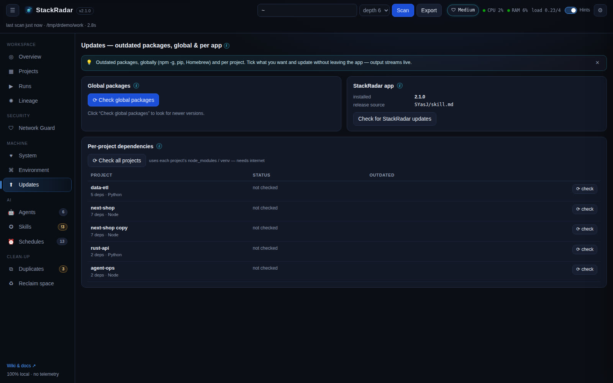

# Package updates

## Global packages
**⟳ Check global packages** runs `npm outdated -g`, `pip list --outdated` and `brew outdated` (whichever exist; needs
internet). Tick packages and click **⬆ update selected**:

| Manager | Command StackRadar runs |
|---|---|
| npm | `npm install -g <pkg>@latest …` |
| pip | `pip install --upgrade <pkg> …` (PEP 668 "externally managed" Pythons will refuse; use pipx / uv / a venv) |
| Homebrew | `brew upgrade <pkg> …` |

## Per project
In the **Updates** tab (or a project's drawer) click **⟳ check** to compare installed vs. latest versions, using the
project's own `node_modules` (npm / pnpm / yarn / bun, chosen from the lockfile) or virtualenv (`.venv`, `venv`, `env`).
Then **⬆ update** one package or all outdated ones:

| Project type | Command |
|---|---|
| npm / pnpm / yarn / bun | `npm install x@latest`, `pnpm add x@latest`, `yarn add x@latest`, `bun add x@latest` |
| Python venv | `<venv>/bin/pip install --upgrade x` |

## How updates run
Every update asks for confirmation, then runs as a **job** with a live log window. Commands are passed as argument
lists (never through a shell) and package names are validated (`^(@scope/)?name$`), so nothing can be injected.
The outdated cache is cleared when a job finishes. Commit your project first: major versions can break things.

## Updating StackRadar itself
**Updates → Check for StackRadar updates** (or ⚙ Settings) asks GitHub Releases for the newest version. The desktop app
downloads and installs updates by itself. See [Desktop app & auto-update](Desktop-App-and-Auto-Update.md).
