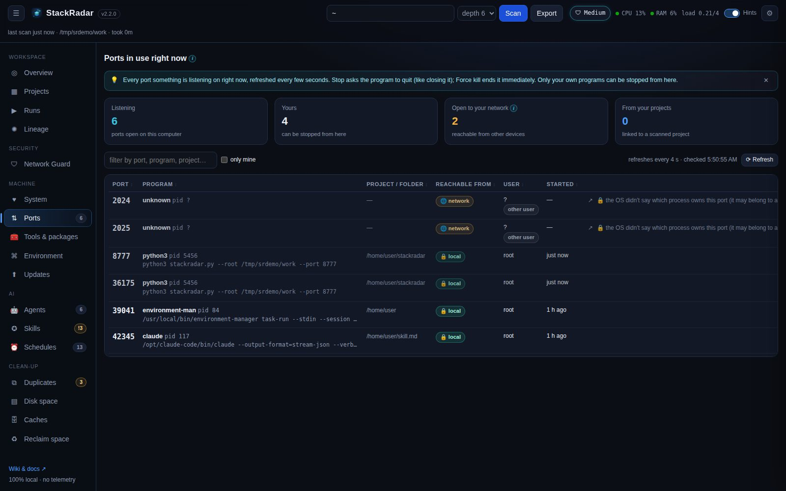

# Ports

**What is listening on my computer right now, and how do I stop it?** The **Ports** tab lists every listening TCP port,
refreshed every 4 seconds.

| Column | Shows |
|---|---|
| **port** | the number, plus what usually runs there (3000 dev server, 5432 PostgreSQL, 11434 Ollama …) |
| **program** | process name, pid, the full command line, and a note for OS services (AirPlay receiver, Docker …) |
| **project / folder** | the scanned project it runs from (📦), or its working folder |
| **reachable from** | 🔒 **local**: only this computer (127.0.0.1). 🌐 **network**: other devices on your Wi-Fi can connect |
| **user / started** | who owns it and when it started |

## Stopping a port

- **■ Stop** asks the program to quit (SIGTERM / `taskkill`), like closing it normally. StackRadar then checks the port
  is really free and tells you if it isn't.
- **✕ Force** ends it immediately (SIGKILL / `taskkill /F`). Anything unsaved in that program is lost.
- **↗** opens `http://localhost:<port>`.

You can stop **your own** programs only. StackRadar itself is never listed as stoppable, and it re-checks that the pid
is still listening on that port right before stopping it (so a recycled pid is never hit). For programs owned by
another user or the system, the row shows the exact command to run in an admin terminal (`sudo kill 1234`,
`taskkill /PID 1234 /F`), with a copy button.

Ports from projects you started in **Runs** are stopped through the run, so its log is kept.

## Where the data comes from

| OS | Source |
|---|---|
| macOS | `lsof -nP -iTCP -sTCP:LISTEN` |
| Linux | `ss -tlnp`, falling back to `/proc/net/tcp` |
| Windows | `netstat -ano` + `tasklist` |
