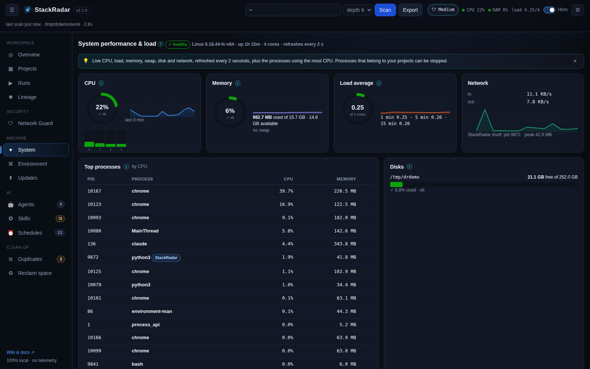

# System monitor

A live view of the machine, sampled every **2 seconds** in the background (the last 5 minutes are kept for the sparklines).

| Panel | What it shows | Source |
|---|---|---|
| **CPU** | total %, per-core bars, sparkline | `/proc/stat` (Linux), `top` (macOS), `GetSystemTimes` (Windows) |
| **Memory** | used / available / total, swap | `/proc/meminfo`, `vm_stat` + `sysctl`, `GlobalMemoryStatusEx` |
| **Load average** | 1 / 5 / 15 min vs. core count | `os.getloadavg()` (not available on Windows) |
| **Network** | in / out bytes per second | `/proc/net/dev` (Linux) |
| **Disks** | free space for home, scan roots and `/` | `shutil.disk_usage` |
| **Top processes** | heaviest by CPU, with memory | `ps` / PowerShell `Get-Process` |

A status badge (✓ healthy / ● busy / ▲ under pressure) sums things up. It turns busy above 60% CPU, 75% memory or load
above the core count, and under pressure above 85% / 90% / 1.5× cores. Status colours always come with an icon and a
word, never colour alone.

Processes whose working directory is inside a scanned project (or that StackRadar started) are tagged **📦 project** and
get a **stop** button. Everything else is read-only. The top bar shows a mini CPU / RAM / load meter on every tab. Click it
to open System. Hover a sparkline for the exact value at that moment.
