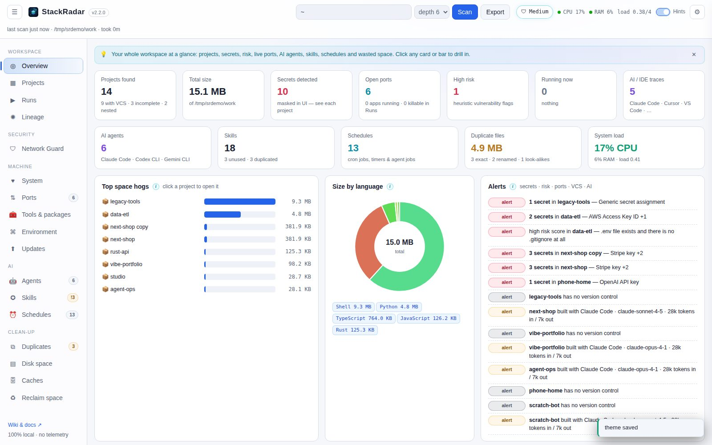
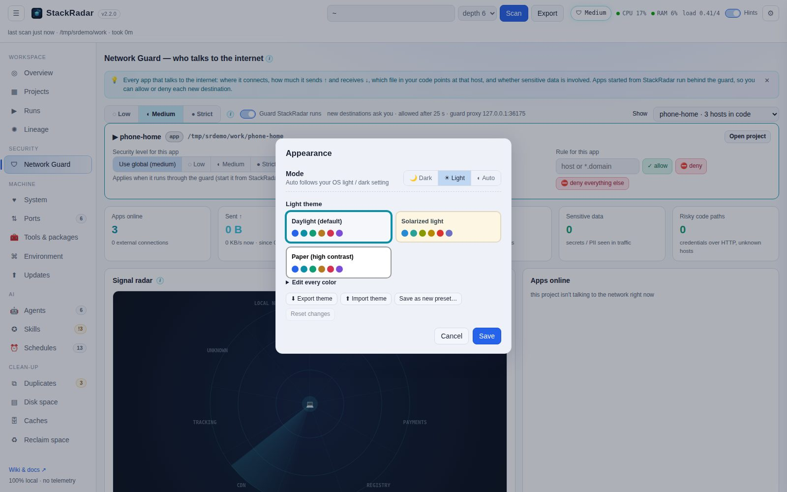

# Themes



**⚙ Settings → Appearance**:

- **Mode**: 🌙 Dark, ☀ Light, or ◐ Auto (follows your OS setting and switches with it).
- **Presets**: Midnight (default dark), Dracula, Nord, High contrast, Daylight (default light), Solarized light,
  Paper (high-contrast light). Each mode remembers its own preset.
- **Edit every color**: open *Edit every color* and change any of the ~45 colors (surfaces, text, lines, accents,
  badge text, buttons, bars and overlays, console and graphs) with a live preview. **↺** puts one back.
- **Save as new preset**, **Export theme** (a small JSON file) and **Import theme** to share themes between machines
  or people.



The theme is stored in `~/.stackradar/settings.json` and applied before the page draws, so there's no flash. The
network radar and lineage graph keep a dark "screen" in every theme so the glowing signals stay readable.

Theme file format:

```json
{ "stackradar_theme": 1, "name": "My theme", "kind": "dark",
  "tokens": { "--bg": "#101418", "--text": "#e8ecf5", "--cyan": "#39c5e0" } }
```
